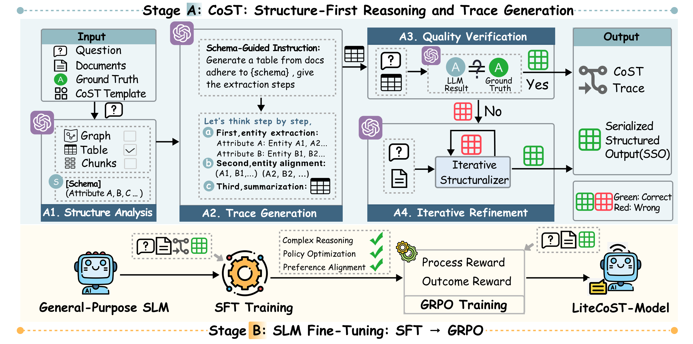
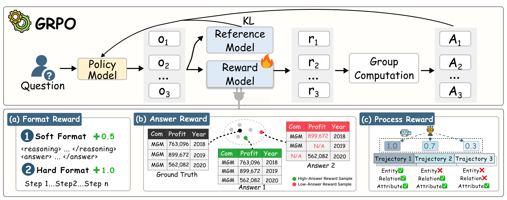
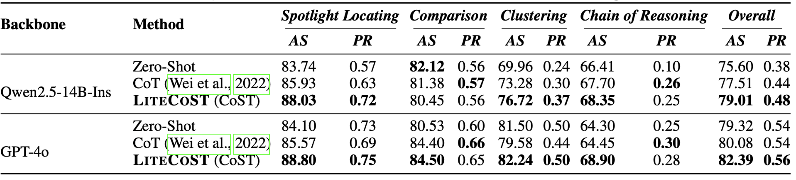
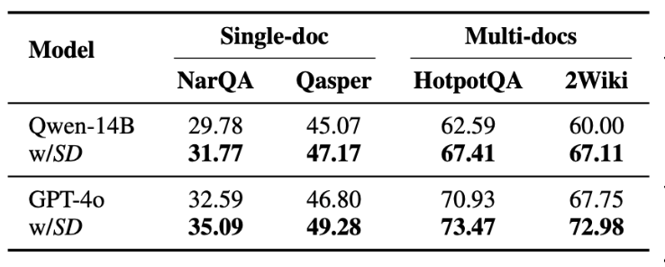
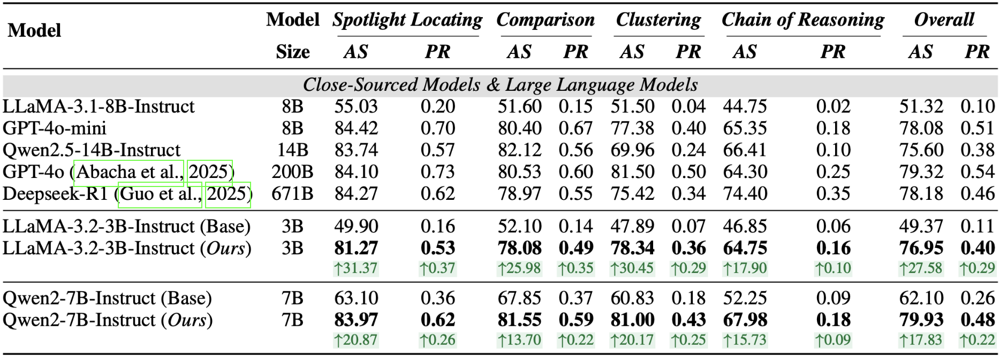
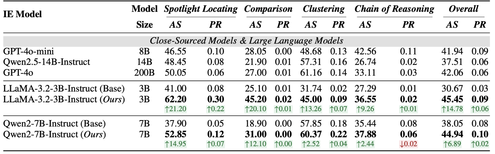
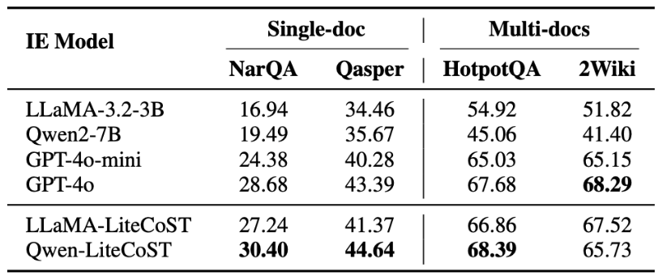

# Long-Document QA with Chain-of-Structured-Thought and Fine-Tuned SLMs
> A two-stage RL-enhanced framework that equips SLMs for high-accuracy long-document QA.

<div align="center">

[](https://openreview.net/forum?id=faECRsdRav)
[](https://github.com/SetonLiang/LiteCoST)
[](https://www.python.org/downloads/release/python-31110/)

</div>


## 🎉 **News**
- **[2026-01-26]** Our **[LiteCoST](https://github.com/SetonLiang/LiteCoST)** is accepted by **ICLR’26**.


## 📋 **Overview**

<div align="center">
  
</div>

**Pillar 1: Chain-of-Structured-Thought (CoST)** uses a high-capability LLM purely as a trace generator: it proposes a minimal structure, executes a step-wise, structure-guided trace over the documents, serializes the result, and verifies/refines it (optionally with an LLM-as-judge). 

<div align="center">
  
</div>

**Pillar 2: SLM fine- tuning (SFT → GRPO)** trains an SLM with the CoST supervision in two phases: Supervised Fine-Tuning to learn structural patterns, formatting rules, and reasoning steps, followed by Group Relative Policy Optimization with dual signals that reward both answer/format quality and step/process consistency—transferring structure-first behavior to an efficient SLM for low-latency deployment.

## 🏗️ Method & Architecture
### CoST: Structure-First Reasoning and Trace Generation 
1. 🔍 Structure Analysis
2. 🧠 Trace Geneartion
3. ✅ Data Verification
4. 🔁 Data Refinement


### SLM Fine-Tuning: SFT → GRPO
1. 🎯 Supervised Fine-Tuning (SFT)
2. ⚡ Group Relative Poilcy Optimization (GRPO)

The core execution of **LiteCoST** is implemented in the src directory (See GRPO in *'verl/'*):
```text
src
├── convert_func.py              # Conversion function module
├── data_refinement.py           # Data refinement module
├── data_verification.py         # Data verification module
├── extract/                     # Extraction module
│   ├── graph.py                 # Graph class
│   ├── main.py                  # Main program
│   ├── table.py                 # Table class
│   ├── to_desc.py               # Convert to description
│   ├── to_graph.py              # Convert to graph 
│   └── to_table.py              # Convert to table
├── sft.py                       # SFT module
├── prompt.py                    # Prompt template module
├── reasoner.py                  # Reasoning module
├── reward.py                    # Reward module
├── structure_analysis/          # Structure analysis module
│   ├── query2schema.py          # Schema construction
│   └── structure_decision.py    # Structure decision
├── cal_latenct.py               # Calculate Latency
└── utils.py                     # Utility functions module
```

## 🛠️ **Usage**
1. Generate the Serialized Structured Output 
```python
python main.py --model gpt-4o --dataset Loong --structured --document

cd src
python data_verification.py
python data_refinement.py
```

2. Conduct SFT Training
```python
python -m src.convert_func # data format conversion
python -m src.sft
```

3. Conduct GRPO Optimization
```python
cd verl
bash scripts/run_grpo_cost.sh

## merge model 
python scripts/model_merger.py merge --backend fsdp --local_dir checkpoints/cost-sft/cost-sft-llama3.2-3b-ins/global_step_1566/actor --target_dir merged/cost-grpo/llama3.2-3b-ins
```

## **Usage Examples**
```python
1. Quick Deployment
cd Loong/src
bash vllm_example.sh

2. Run the pipeline
python main.py --model deployed_model --dataset Loong --structured --document
```


## 🎯 **Performance**

<div align="center">

<p><b>Efficacy of Chain-of-Structured-Thought (CoST).</b></p>

<div style="display: flex; justify-content: center; align-items: flex-start; gap: 16px;">
  <figure style="margin: 0; flex: 1; text-align: center;">
    
    <figcaption><b>Finance</b></figcaption>
  </figure>
  <!-- <figure style="margin: 0; flex: 1; text-align: center;">
    
    <figcaption><b>General Knowledge</b></figcaption> -->
  </figure>
</div>

<p><b>Effectiveness: How good is LiteCoST for SSO Generation?</b></p>

<div style="display: flex; justify-content: center; gap: 16px; margin-top: 16px;">
  <figure style="margin: 0; flex: 1;">
    
    <figcaption><b>Finance</b></figcaption>
  </figure>
  <figure style="margin: 0; flex: 1;">
    
    <figcaption><b>Legal</b></figcaption>
  </figure>
  <!-- <figure style="margin: 0; flex: 1;">
    
    <figcaption><b>General Knowledge</b></figcaption>
  </figure> -->
</div>

</div>

## Acknowledgement
We implement our reinforcement learning algorithm by extending the [veRL framework](https://github.com/volcengine/verl). For efficient inference, we leverage [vLLM](https://github.com/vllm-project/vllm), and we develop evaluation scripts based on the [Loong datasets](https://github.com/MozerWang/Loong). We sincerely thank these communities for their valuable contributions!


